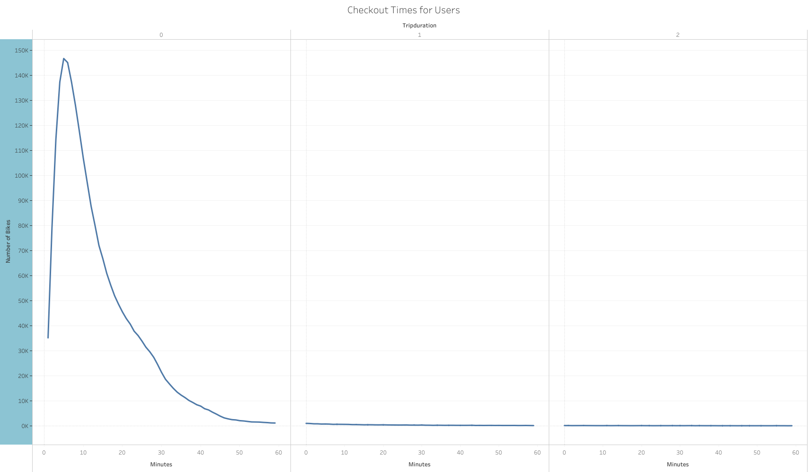
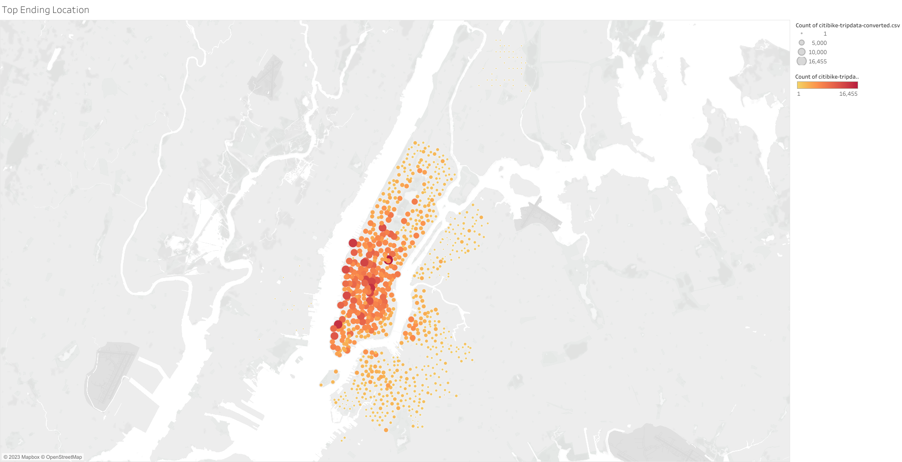

# bikesharing

## Overview of the Analysis

The purpose of this project is to analyze the bike sharing data from New York City and create visualizations to impress the angel investors looking to provide the seed funding for a similar Bike Share program for Des Moines, Iowa.

## Results

[Click here](https://public.tableau.com/app/profile/parna.kundu/viz/bikesharing_16740600105470/BikesharingOverview?publish=yes) to see the complete results of the New York City Bike Sharing data Analysis. 

A few of the visualization are described as follows :-

1. "Checkout Times for Users" - This chart shows that most users check out bikes for 5 minutes approximately.  

2. "Checkout Times by Gender" - This chart shows that both male and female users checkout bikes for roughly 5 minutes although there are more male users as compared to female users.

3. "Trips for each hour of each day of the week" - Most popular time of the day is 8 AM and 5-6 PM and the most popular day of the week is Thursday.

4. "Trips by Gender for each hour of each day of the week" - 8 AM and 5-6 PM are popular ride sharing times for both genders.

5. "Trips for each type of user and gender for each day of the week" - Subscribers use the program more than customers. The program is most popular with male subscribers.

6. "Peak Hours of Bike Use in August" - Peak hours of operation are 5-6 PM in August.

7. "Popular Starting Point" - This chart depicts the most popular locations where tourists start their journey.

8. "Popular Ending Point" - This chart depicts the most popular locations where tourists end their journey.

## Summary

Analysis of the Bike Sharing data from New York shows that most customers checkout the bikes for an optimal time of 5 minutes. This data will be helpful to determine the number of bikes needed as inventory. 

Looking at the Top_Starting_Location and Top_Ending_Location gives an idea as to how the bikes have to be distributed over different ride share stations. The more frequented spots should have more bikes available at the busiest time.

The August_Peak_Hours visualization gives an idea of the busiest time of the day. All bike maintenance decisions can be made to avoid the busy time.

Additional analysis :-

* Analysis can be done to see the imapct of age with the use of the bike sharing program. This could influence the marketing team to cater to the age group most likely to use this program in the future.

* Analysis can also be done to find the most used bike so that maintenance can be scheduled after a predetermined time to keep them working in optimal condition.
 